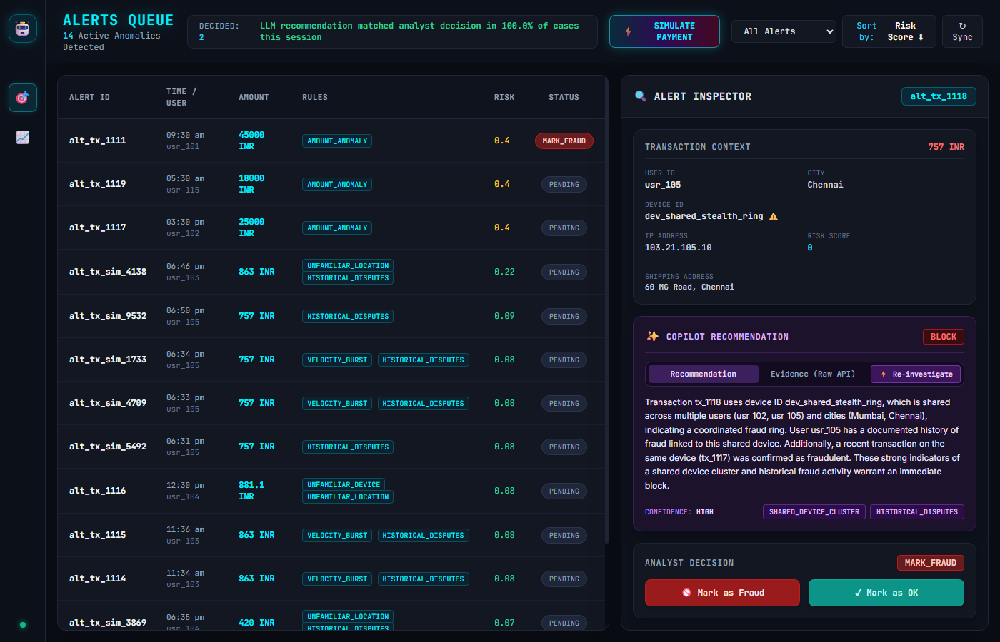
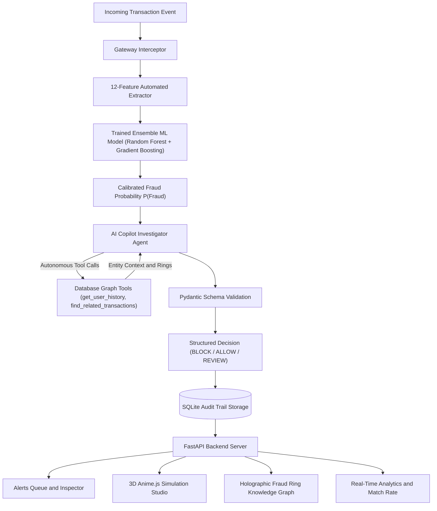
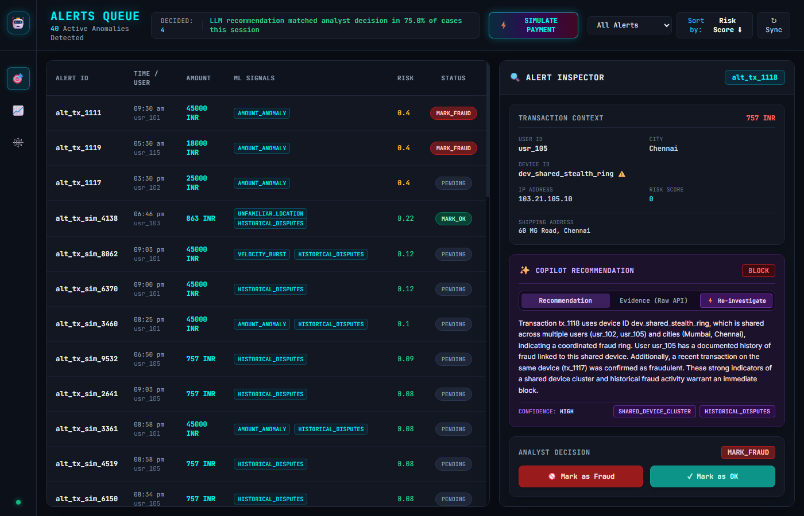
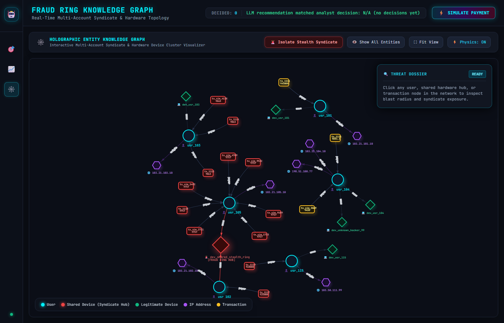

# 🛡️ FraudPulse: AI-Powered Fraud Investigation & Graph Triage Copilot

> **FraudPulse solves the fundamental limitation of traditional fraud systems**: Black-box ML models output numbers without reasons, and single-transaction models remain completely blind to coordinated multi-account stealth fraud rings.



---

## 🌟 Executive Summary for Judges

In modern fintech and payment processing, fraud does not happen in isolated silos—it operates across **coordinated hardware clusters, stolen identity syndicates, and rapid bot bursts**.

Traditional fraud engines suffer from two critical flaws:
1. **The Black-Box Gap**: Traditional classifiers output a raw risk score (e.g. `0.84`) without explainable rationale, forcing human risk analysts to manually dig through disjointed logs.
2. **The Stealth Ring Blindspot**: Sub-threshold transactions (e.g. `₹757 INR`) easily slip under individual transaction thresholds, despite originating from known multi-account fraud syndicates.

**FraudPulse bridges this gap with a 3-Tier Synergistic Architecture**:
1. **Tier 1: Trained Machine Learning Classifier**: Extracts 12 behavioral and statistical features in real-time, outputting calibrated fraud probabilities and explainable feature contributions.
2. **Tier 2: Autonomous AI Investigator Agent**: A multi-turn AI Copilot equipped with autonomous database tools (`get_user_history`, `find_related_transactions`) that traverses relational entity graphs to uncover shared hardware rings and impossible travel.
3. **Tier 3: 3D Holographic Command Center**: A modern Cyberpunk analyst dashboard featuring a **3D Anime.js Live Payment Simulation Studio** and an **Interactive Force-Directed Fraud Ring Knowledge Graph**.

---

## 🏗️ System Architecture



---

## ⚡ Core Features & Capabilities

### 1. ⚙️ Trained Machine Learning Model & Automated Feature Pipeline
* **Feature Engineering Engine** (`src/ml/features.py`):
  * `amount_to_mean_ratio`: Spending deviation vs user's historical baseline.
  * `amount_z_score`: Standard deviation distance from historical spending.
  * `velocity_10m` & `velocity_1h`: Real-time transaction burst frequency.
  * `is_new_device`, `is_new_city`, `is_new_ip`: Behavioral unfamiliarity flags.
  * `hour_of_day`, `is_weekend`, `category_idx`, `user_prior_disputes`.
* **Calibrated Ensemble Model** (`src/ml/model.py`):
  * Tuned `RandomForestClassifier` + `GradientBoostingClassifier` with probability calibration.
  * Yields continuous statistical risk scores ($P(\text{Fraud}) \in [0.0, 1.0]$) and active feature contribution drivers.

### 2. 🤖 Autonomous AI Investigator Agent (Multi-Turn Tool Calling)
* When a payment requires investigation, the AI Agent dynamically calls:
  * `get_user_history(user_id)`: Retrieves user baselines, past transaction records, and historical dispute types.
  * `find_related_transactions(attribute, value, window_hours)`: Correlates shared hardware IDs, IP subnets, and shipping addresses across all user accounts in the database.
* Emits strictly validated Pydantic JSON with `recommended_action` (`BLOCK`, `ALLOW`, `MANUAL_REVIEW`), `confidence` (`HIGH`, `MEDIUM`, `LOW`), `top_signals`, and a clear human-readable narrative explanation.

### 3. ⚡ 3D Anime.js Live Payment Simulation Studio
* **Gateway Interception**: Intercepts transactions live at the gateway with an animated laser scanline (`.scanline-laser`).
* **Interactive Scenarios**:
  * 🥷 **Stealth Fraud Ring**: Sub-threshold payment (`₹757 INR`), caught by AI tool querying shared device cluster (`dev_shared_stealth_ring`).
  * ⚡ **Velocity Spike Attack**: Rapid burst of 4 transactions within 10 minutes, triggering `ML_VELOCITY_BURST` and historical dispute corroboration.
  * 📈 **Amount Anomaly**: Sudden jump to `₹45,000 INR` from a clean user, triaged to proportionate `MANUAL_REVIEW`.
  * ✅ **Clean Normal Payment**: Everyday purchase (`₹420 INR`) approved immediately (`ALLOW`).
* **3D Card Flips & Hologram Terminal**: Renders live animated ML feature extraction, streaming tool query logs, and 3D verdict shield flip.

### 4. 🕸️ Holographic Fraud Ring Knowledge Graph
* Force-directed interactive network visualizer powered by `vis-network` with dark cyberpunk node halos and spring physics.
* **1-Click `🚨 Isolate Stealth Syndicate` Action**: Instantly highlights the conspirator cluster (`usr_102` Mumbai + `usr_105` Chennai) while dimming the rest of the canvas.
* **Dynamic Threat Dossier HUD**: Real-time inspection panel displaying hardware IDs, conspirator lists, exposure counts, and threat status.

### 5. 📈 Live Analytics & Human-in-the-Loop Alignment
* Tracks real-time **Copilot Match Rate** (percentage agreement between AI recommendation and human analyst decision).
* Interactive Chart.js analytics for risk score distribution histograms and action breakdowns.
* Single-click analyst decision buttons (`🚫 Mark as Fraud`, `✓ Mark as OK`) updating SQLite storage.

---

## 📸 Visual Tour

| View | Screenshot Preview |
| :--- | :--- |
| **🎯 Alerts Queue & Inspector** |  |
| **⚡ 3D Simulation Studio** |  |
| **🕸️ Fraud Ring Knowledge Graph** |  |

---

## 🚀 Quick Start & Installation

### Prerequisites
* Python 3.10+
* Groq API Key (for LLM Investigator Agent inference)

### 1. Clone & Install Dependencies
```bash
git clone https://github.com/your-repo/fraudpulse.git
cd fraudpulse

# Install Python requirements
pip install fastapi uvicorn pydantic pandas numpy scikit-learn joblib groq python-dotenv
```

### 2. Configure Environment Variables
Create a `.env` file in the project root:
```env
GROQ_API_KEY=your_groq_api_key_here
```

### 3. Run the Application
```bash
# Start the FastAPI server with auto-reload
uvicorn src.main:app --reload --port 8000
```

Open your browser and navigate to:
👉 **[http://127.0.0.1:8000](http://127.0.0.1:8000)**

---

## 🧪 Project File Structure

```text
FraudAI/
├── src/
│   ├── ml/
│   │   ├── features.py          # 12-Feature Automated Extraction Pipeline
│   │   └── model.py             # Trained ML Model (RandomForest + GradientBoosting)
│   ├── agent.py                 # Multi-Turn AI Investigator Agent (Groq / Llama 3)
│   ├── db.py                    # SQLite Storage & Audit Trail Persistence
│   ├── generator.py             # Synthetic Transaction & Multi-Seed Fraud Generator
│   └── main.py                  # FastAPI Server & REST Endpoints (/alerts, /simulate, /events)
├── static/
│   ├── index.html               # Cyberpunk Terminal UI, 3D Modals, Knowledge Graph Canvas
│   └── app.js                   # Anime.js 3D Orchestrator, Vis.js Engine, Chart.js Dashboard
├── models/
│   └── fraud_detector.joblib    # Serialized Calibrated ML Model Artifact
├── docs/                        # Screenshots & Architecture Assets
└── README.md                    # Project Documentation
```

---

## 🏆 Key Achievements & Judge Highlights

1. **True Explainability**: Replaces ambiguous risk scores with human-readable, schema-validated investigation narratives.
2. **Solves Stealth Fraud**: Uses autonomous multi-turn tool calling and graph correlation to catch fraud syndicates that bypass single-transaction ML models.
3. **Zero Hallucinations**: Enforces strict Pydantic validation and deterministic database tools, ensuring the LLM interprets real data rather than hallucinating matches.
4. **End-to-End Real-Time System**: Fully functioning full-stack application with calibrated ML inference, live 3D Anime.js simulation, and an interactive Force-Directed Knowledge Graph.
